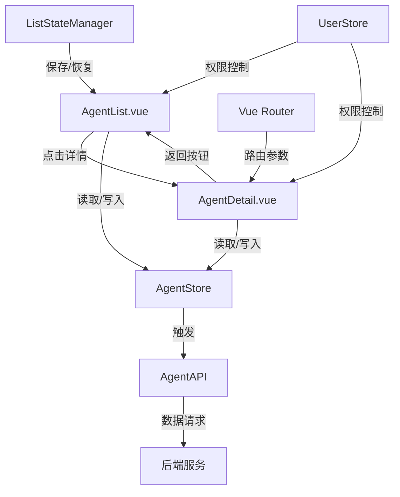

# 代理列表与详情页面集成设计文档

## 概述

本设计文档详细说明了代理列表与详情页面之间的交互和数据流设计，旨在实现更流畅的用户体验、一致的数据展示和高效的导航机制。设计专注于使用Vue 3的Composition API和Pinia状态管理来解决页面间状态保存和数据同步问题。

## 架构

### 总体架构

整体架构采用Vue 3 + Pinia + Vue Router的组合，具体组件和数据流如下：



### 核心组件

1. **AgentStore (Pinia)**: 集中存储代理数据和列表状态
2. **ListStateManager (Composable)**: 管理列表页面的筛选、排序和分页状态
3. **AgentList.vue**: 代理列表页面组件
4. **AgentDetail.vue**: 代理详情页面组件
5. **AgentFormDialog.vue**: 代理编辑对话框组件(在两个页面共享)
6. **Router**: 负责页面导航和参数传递

## 组件与接口

### 1. AgentStore (Pinia状态管理)

```typescript
// 代理状态存储
export const useAgentStore = defineStore('agent', {
  state: () => ({
    // 代理数据
    agentList: [] as Agent[],
    agentDetail: null as Agent | null,
    totalItems: 0,
    
    // 列表状态
    listState: {
      filters: {
        keyword: '',
        status: '',
        category: '',
        level: '',
        isAdded: false,
        isPosting: false,
        isIntercept: false,
        isAttracting: false,
        isInGroup: false,
      },
      pagination: {
        page: 1,
        pageSize: 10,
      },
      selectedAgents: [] as string[],
    },
    
    // 加载状态
    loading: {
      list: false,
      detail: false,
      action: false,
    },
  }),
  
  getters: {
    // 获取当前代理列表
    getAgentList: (state) => state.agentList,
    
    // 获取当前代理详情
    getAgentDetail: (state) => state.agentDetail,
    
    // 获取列表状态
    getListState: (state) => state.listState,
  },
  
  actions: {
    // 获取代理列表
    async fetchAgentList() {
      this.loading.list = true;
      try {
        const { page, pageSize } = this.listState.pagination;
        const queryParams = {
          page,
          pageSize,
          ...this.listState.filters,
        };
        
        const response = await agentApi.getAgentList(queryParams);
        this.agentList = response.data;
        this.totalItems = response.total;
      } catch (error) {
        console.error('Failed to fetch agents:', error);
        // 触发全局错误通知
      } finally {
        this.loading.list = false;
      }
    },
    
    // 获取代理详情
    async fetchAgentDetail(id: string) {
      this.loading.detail = true;
      try {
        const agentData = await agentApi.getAgent(id);
        this.agentDetail = agentData;
      } catch (error) {
        console.error('Failed to fetch agent detail:', error);
        // 触发全局错误通知
      } finally {
        this.loading.detail = false;
      }
    },
    
    // 更新代理信息
    async updateAgent(id: string, data: Partial<Agent>) {
      this.loading.action = true;
      try {
        await agentApi.updateAgent(id, data);
        
        // 更新本地存储的数据
        if (this.agentDetail && this.agentDetail.id === id) {
          this.agentDetail = { ...this.agentDetail, ...data };
        }
        
        // 更新列表中的数据
        const index = this.agentList.findIndex(agent => agent.id === id);
        if (index !== -1) {
          this.agentList[index] = { ...this.agentList[index], ...data };
        }
        
        return true;
      } catch (error) {
        console.error('Failed to update agent:', error);
        // 触发全局错误通知
        return false;
      } finally {
        this.loading.action = false;
      }
    },
    
    // 删除代理
    async deleteAgent(id: string) {
      this.loading.action = true;
      try {
        await agentApi.deleteAgent(id);
        
        // 从列表中移除
        this.agentList = this.agentList.filter(agent => agent.id !== id);
        
        // 如果当前详情页是该代理，清空详情
        if (this.agentDetail && this.agentDetail.id === id) {
          this.agentDetail = null;
        }
        
        return true;
      } catch (error) {
        console.error('Failed to delete agent:', error);
        // 触发全局错误通知
        return false;
      } finally {
        this.loading.action = false;
      }
    },
    
    // 更新列表筛选条件
    updateFilters(filters: Partial<typeof this.listState.filters>) {
      this.listState.filters = { ...this.listState.filters, ...filters };
      // 重置到第一页
      this.listState.pagination.page = 1;
    },
    
    // 更新分页信息
    updatePagination(pagination: Partial<typeof this.listState.pagination>) {
      this.listState.pagination = { ...this.listState.pagination, ...pagination };
    },
    
    // 重置列表状态
    resetListState() {
      this.listState = {
        filters: {
          keyword: '',
          status: '',
          category: '',
          level: '',
          isAdded: false,
          isPosting: false,
          isIntercept: false,
          isAttracting: false,
          isInGroup: false,
        },
        pagination: {
          page: 1,
          pageSize: 10,
        },
        selectedAgents: [],
      };
    },
  },
});
```

### 2. useListState (Composable)

```typescript
// 列表状态管理Composable
export function useListState() {
  const agentStore = useAgentStore();
  const route = useRoute();
  const router = useRouter();
  
  // 从URL同步状态到Store
  const syncStateFromURL = () => {
    const query = route.query;
    
    // 同步筛选条件
    const filters: Record<string, any> = {};
    
    if (query.keyword) filters.keyword = query.keyword as string;
    if (query.status) filters.status = query.status as string;
    if (query.category) filters.category = query.category as string;
    if (query.level) filters.level = query.level as string;
    
    // 布尔值需要特殊处理
    if (query.isAdded) filters.isAdded = query.isAdded === 'true';
    if (query.isPosting) filters.isPosting = query.isPosting === 'true';
    if (query.isIntercept) filters.isIntercept = query.isIntercept === 'true';
    if (query.isAttracting) filters.isAttracting = query.isAttracting === 'true';
    if (query.isInGroup) filters.isInGroup = query.isInGroup === 'true';
    
    // 同步分页
    const pagination: Record<string, any> = {};
    if (query.page) pagination.page = parseInt(query.page as string);
    if (query.pageSize) pagination.pageSize = parseInt(query.pageSize as string);
    
    // 更新Store
    if (Object.keys(filters).length > 0) {
      agentStore.updateFilters(filters);
    }
    
    if (Object.keys(pagination).length > 0) {
      agentStore.updatePagination(pagination);
    }
  };
  
  // 从Store同步状态到URL
  const syncStateToURL = () => {
    const listState = agentStore.getListState;
    const query: Record<string, string> = {};
    
    // 只保存非空值
    if (listState.filters.keyword) query.keyword = listState.filters.keyword;
    if (listState.filters.status) query.status = listState.filters.status;
    if (listState.filters.category) query.category = listState.filters.category;
    if (listState.filters.level) query.level = listState.filters.level;
    
    // 布尔值转字符串
    if (listState.filters.isAdded) query.isAdded = 'true';
    if (listState.filters.isPosting) query.isPosting = 'true';
    if (listState.filters.isIntercept) query.isIntercept = 'true';
    if (listState.filters.isAttracting) query.isAttracting = 'true';
    if (listState.filters.isInGroup) query.isInGroup = 'true';
    
    // 分页信息
    query.page = listState.pagination.page.toString();
    query.pageSize = listState.pagination.pageSize.toString();
    
    // 更新URL，不触发新的导航
    router.replace({ query }, { preserveState: true });
  };
  
  // 导航到详情页，保留当前列表状态
  const navigateToDetail = (id: string) => {
    // 先同步状态到URL
    syncStateToURL();
    
    // 导航到详情页
    router.push({
      name: 'AgentDetail',
      params: { id },
      // 设置列表返回标志
      query: { from: 'list' }
    });
  };
  
  // 返回列表页，恢复之前的状态
  const navigateBackToList = () => {
    router.push({ name: 'AgentList' });
  };
  
  // 监听路由变化，从URL同步状态
  watch(() => route.fullPath, () => {
    if (route.name === 'AgentList') {
      syncStateFromURL();
    }
  }, { immediate: true });
  
  return {
    syncStateFromURL,
    syncStateToURL,
    navigateToDetail,
    navigateBackToList
  };
}
```

### 3. 修改AgentList.vue

主要更改:
- 使用Pinia存储来管理数据和状态
- 使用useListState Composable管理列表状态
- 更新页面导航逻辑

关键部分代码修改:

```vue
<script setup lang="ts">
// 引入必要的组件和composables
import { ref, onMounted, computed, h } from 'vue'
import { useAgentStore } from '@/store/agent'
import { useListState } from '@/composables/useListState'
import { storeToRefs } from 'pinia'

// 使用Pinia Store
const agentStore = useAgentStore()
const { agentList, totalItems, listState, loading } = storeToRefs(agentStore)

// 使用列表状态管理
const { syncStateToURL, navigateToDetail } = useListState()

// 获取代理列表数据
const fetchAgents = async () => {
  await agentStore.fetchAgentList()
  // 同步状态到URL
  syncStateToURL()
}

// 切换筛选条件
const toggleFilter = (filterName: string) => {
  if (filterName === 'isAdded' || filterName === 'isPosting' || 
      filterName === 'isIntercept' || filterName === 'isAttracting' || 
      filterName === 'isInGroup') {
    const key = filterName as 'isAdded' | 'isPosting' | 'isIntercept' | 'isAttracting' | 'isInGroup';
    agentStore.updateFilters({ [key]: !listState.value.filters[key] });
  }
  searchAgents()
}

// 搜索代理
const searchAgents = () => {
  fetchAgents()
}

// 处理分页变更
const handlePageChange = (page: number) => {
  agentStore.updatePagination({ page })
  fetchAgents()
}

// 查看代理详情
const viewAgentDetail = (agentId: string) => {
  navigateToDetail(agentId)
}

// 操作列修改
const columns = [
  // ... 其他列保持不变
  {
    id: 'actions',
    header: '操作',
    cell: ({ row }: { row: any }) => {
      return h('div', { class: 'flex items-center space-x-2' }, [
        h(Button, {
          size: 'sm',
          variant: 'ghost',
          class: 'h-8 w-8 p-0',
          onClick: () => editAgent(row.id)
        }, () => h(PencilIcon, { class: 'h-4 w-4' })),
        
        h(Button, {
          size: 'sm',
          variant: 'ghost',
          class: 'h-8 w-8 p-0',
          onClick: () => deleteAgent(row.id)
        }, () => h(TrashIcon, { class: 'h-4 w-4' })),
        
        h(Button, {
          size: 'sm',
          variant: 'ghost',
          class: 'h-8 w-8 p-0',
          onClick: () => viewAgentDetail(row.id)
        }, () => h(MoreHorizontalIcon, { class: 'h-4 w-4' }))
      ])
    }
  }
]

// 初始化
onMounted(() => {
  fetchAgents()
})
</script>
```

### 4. 修改AgentDetail.vue

主要更改:
- 使用Pinia存储来管理数据
- 实现返回列表的状态保存
- 添加固定操作面板
- 增加数据可视化和权限控制

关键部分代码修改:

```vue
<template>
  <div class="agent-detail-container">
    <!-- 添加返回按钮 -->
    <div class="mb-4 flex items-center">
      <Button variant="outline" size="sm" class="flex items-center gap-2" @click="navigateBackToList">
        <svg xmlns="http://www.w3.org/2000/svg" width="16" height="16" viewBox="0 0 24 24" fill="none" stroke="currentColor" stroke-width="2" stroke-linecap="round" stroke-linejoin="round" class="lucide-arrow-left"><path d="m12 19-7-7 7-7"></path><path d="M19 12H5"></path></svg>
        返回代理列表
      </Button>
    </div>
    
    <!-- 固定操作面板 -->
    <div class="fixed bottom-4 right-4 flex flex-col gap-2 z-50" v-if="hasEditPermission">
      <Button size="sm" variant="default" @click="openEditDialog" class="rounded-full h-12 w-12 flex items-center justify-center p-0">
        <PencilIcon class="h-5 w-5" />
      </Button>
      <Button size="sm" variant="destructive" @click="confirmDelete" class="rounded-full h-12 w-12 flex items-center justify-center p-0">
        <TrashIcon class="h-5 w-5" />
      </Button>
    </div>
    
    <!-- 其他内容保持不变 -->
    
    <!-- 新增业绩数据图表 -->
    <Card v-if="hasPerformanceViewPermission" class="mb-4">
      <CardHeader>
        <div class="flex justify-between items-center">
          <CardTitle>业绩趋势</CardTitle>
          <div class="flex items-center gap-2">
            <Select v-model="chartPeriod">
              <option value="week">本周</option>
              <option value="month">本月</option>
              <option value="quarter">本季度</option>
              <option value="year">本年</option>
            </Select>
          </div>
        </div>
      </CardHeader>
      <CardContent>
        <!-- 这里将放置性能图表组件 -->
        <div class="h-80 w-full" ref="chartContainer"></div>
      </CardContent>
    </Card>
  </div>
</template>

<script setup lang="ts">
import { ref, onMounted, computed, watch } from 'vue'
import { useRoute, useRouter } from 'vue-router'
import { useAgentStore } from '@/store/agent'
import { useUserStore } from '@/store/user'
import { useListState } from '@/composables/useListState'
import { storeToRefs } from 'pinia'
import { Card, CardHeader, CardContent, CardTitle } from '@/components/ui/card'
import { Badge } from '@/components/ui/badge'
import { Button } from '@/components/ui/button'
import { PencilIcon, TrashIcon, RefreshCwIcon } from 'lucide-vue-next'
import { Dialog, DialogContent, DialogDescription, DialogFooter, DialogHeader, DialogTitle } from '@/components/ui/dialog'
import { Select } from '@/components/ui/select'
import { AgentCategory, AgentStatus } from '@/types/agent'

// 使用Pinia Store
const agentStore = useAgentStore()
const userStore = useUserStore()
const { agentDetail, loading } = storeToRefs(agentStore)
const route = useRoute()
const router = useRouter()

// 使用列表状态管理
const { navigateBackToList } = useListState()

// 图表周期选择
const chartPeriod = ref('month')
const chartContainer = ref<HTMLElement | null>(null)
// 编辑和删除对话框状态
const showEditDialog = ref(false)
const showDeleteDialog = ref(false)

// 获取代理详情
const fetchAgentDetail = async () => {
  const id = route.params.id as string
  await agentStore.fetchAgentDetail(id)
  
  // 如果没有找到代理数据，显示错误或重定向
  if (!agentDetail.value) {
    // TODO: 显示错误消息
    router.push('/agent/list')
  }
}

// 权限控制
const hasEditPermission = computed(() => {
  // 根据用户角色判断是否有编辑权限
  const userRole = userStore.userRole
  // 管理员和销售总监可以编辑所有代理
  if (['super_admin', 'director'].includes(userRole)) {
    return true
  }
  // 销售组长只能编辑其组内代理
  if (userRole === 'leader') {
    // 假设agentDetail中有groupId字段，userStore中有userGroupId字段
    return agentDetail.value?.groupId === userStore.userGroupId
  }
  return false
})

const hasPerformanceViewPermission = computed(() => {
  // 管理员、销售总监和销售组长可以查看业绩数据
  return ['super_admin', 'director', 'leader'].includes(userStore.userRole)
})

// 打开编辑对话框
const openEditDialog = () => {
  showEditDialog.value = true
}

// 确认删除
const confirmDelete = () => {
  showDeleteDialog.value = true
}

// 删除代理
const deleteAgent = async () => {
  if (!agentDetail.value) return
  
  const success = await agentStore.deleteAgent(agentDetail.value.id)
  if (success) {
    // 跳转回列表页
    navigateBackToList()
  }
  showDeleteDialog.value = false
}

// 自动刷新数据（每60秒）
let refreshInterval: number | undefined

const startAutoRefresh = () => {
  refreshInterval = window.setInterval(() => {
    if (agentDetail.value) {
      agentStore.fetchAgentDetail(agentDetail.value.id)
    }
  }, 60000) // 60秒刷新一次
}

const stopAutoRefresh = () => {
  if (refreshInterval) {
    clearInterval(refreshInterval)
  }
}

// 初始化图表
const initChart = () => {
  if (!chartContainer.value || !agentDetail.value) return
  
  // 这里将实现图表初始化
  // 根据选择的周期加载不同的数据
  // TODO: 实现实际的图表代码
}

// 监听图表周期变化
watch(chartPeriod, () => {
  initChart()
})

onMounted(() => {
  fetchAgentDetail()
  startAutoRefresh()
  initChart()
})

onUnmounted(() => {
  stopAutoRefresh()
})
</script>
```

### 5. 路由配置更新

```typescript
// 代理相关路由配置
const agentRoutes = [
  {
    path: '/agent',
    component: () => import('@/layouts/MainLayout.vue'),
    meta: { requiresAuth: true },
    children: [
      {
        path: 'list',
        name: 'AgentList',
        component: () => import('@/views/agent/AgentList.vue'),
        meta: { 
          title: '代理管理',
          roles: ['super_admin', 'director', 'leader', 'sales'] 
        }
      },
      {
        path: 'detail/:id',
        name: 'AgentDetail',
        component: () => import('@/views/agent/AgentDetail.vue'),
        meta: { 
          title: '代理详情',
          roles: ['super_admin', 'director', 'leader', 'sales'] 
        },
        props: true
      }
    ]
  }
]
```

## 数据模型

### Agent数据模型

扩展现有的Agent类型定义，添加权限相关字段：

```typescript
// 扩展Agent类型
export interface Agent {
  id: string;
  name: string;
  wechatName: string;
  phone: string;
  category: string | AgentCategory;
  level: string | AgentLevel;
  addedDate: string;
  createdAt: string;
  updatedAt: string;
  referrer: string;
  referralCode: string;
  isAdded: boolean;
  isPosting: boolean;
  isIntercept: boolean;
  isAttracting: boolean;
  isInGroup: boolean;
  notes: string;
  redBookAccount: string;
  status: string | AgentStatus;
  
  // 新增字段
  groupId?: string;  // 所属组ID
  groupName?: string;  // 所属组名称
  managerId?: string;  // 管理人员ID
  managerName?: string;  // 管理人员名称
}

// 代理业绩数据模型
export interface AgentPerformance {
  clientsTotal: number;  // 总客户数
  validClients: number;  // 有效客户数
  invalidClients: number;  // 无效客户数
  pendingClients: number;  // 待处理客户数
  closedDeals: number;  // 成交数
  totalRevenue: number;  // 总收入
  commission: number;  // 佣金
  baseSalary: number;  // 基本工资
  performance: number;  // 绩效
  periodStart: string;  // 统计周期开始时间
  periodEnd: string;  // 统计周期结束时间
  
  // 新增趋势数据
  trendData?: {
    labels: string[];  // 日期标签
    revenue: number[];  // 收入趋势
    clients: number[];  // 客户数趋势
    commission: number[];  // 佣金趋势
  }
}
```

### 列表状态模型

定义在Pinia Store中的列表状态数据结构：

```typescript
export interface AgentListState {
  filters: {
    keyword: string;
    status: string;
    category: string;
    level: string;
    isAdded: boolean;
    isPosting: boolean;
    isIntercept: boolean;
    isAttracting: boolean;
    isInGroup: boolean;
  };
  pagination: {
    page: number;
    pageSize: number;
  };
  selectedAgents: string[];  // 选中的代理ID列表
}
```

## 错误处理

采用统一的错误处理机制，包括以下几个层面：

1. **API请求层错误处理**：
   - 使用全局请求拦截器捕获API错误
   - 根据错误类型显示适当的消息

2. **组件层错误处理**：
   - 使用try-catch捕获异步操作错误
   - 显示用户友好的错误消息
   - 提供重试机制

3. **权限错误处理**：
   - 检测用户访问无权限的页面或执行无权限的操作
   - 显示权限错误消息并提供返回选项

4. **加载状态管理**：
   - 在Pinia Store中集中管理不同操作的加载状态
   - 在UI中显示适当的加载指示器

## 测试策略

为确保代理列表与详情页面集成功能的质量，我们将采用以下测试策略：

### 1. 单元测试

- 测试Pinia Store的各个action和mutation
- 测试路由导航和参数传递
- 测试数据过滤和状态保存逻辑

### 2. 组件测试

- 测试AgentList.vue和AgentDetail.vue的关键功能
- 测试共享组件的复用性和正确性
- 模拟不同的用户角色和权限场景

### 3. 集成测试

- 测试列表到详情页的完整导航流程
- 测试数据同步和状态保存功能
- 测试实时数据更新机制

### 4. 端到端测试

- 模拟真实用户场景，测试完整的代理管理流程
- 测试不同设备和屏幕尺寸下的响应式布局
- 测试权限控制和数据访问限制

## 性能考虑

为确保代理列表与详情页面的高性能和良好用户体验，我们将采取以下措施：

1. **数据缓存**：
   - 使用Pinia Store缓存已加载的代理数据
   - 避免重复请求相同的数据

2. **按需加载**：
   - 使用Vue Router的懒加载功能
   - 只加载当前视图所需的组件

3. **分页优化**：
   - 实现高效的服务器端分页
   - 只加载和渲染当前页的数据

4. **防抖和节流**：
   - 对搜索和筛选操作应用防抖
   - 对滚动和调整大小事件应用节流

5. **虚拟滚动**：
   - 对大量数据列表考虑使用虚拟滚动
   - 只渲染可见区域的项目

## 安全考虑

为确保代理数据的安全性和访问控制，我们将实施以下安全措施：

1. **基于角色的访问控制**：
   - 严格按照用户角色限制页面和操作访问
   - 在前端和后端同时实施权限检查

2. **数据过滤**：
   - 根据用户角色过滤敏感数据
   - 只向客户端发送必要的数据字段

3. **安全的API调用**：
   - 使用JWT令牌进行API认证
   - 验证所有传入的参数和数据

4. **防止XSS攻击**：
   - 对用户输入进行适当的转义和验证
   - 使用Vue的内置XSS防护机制 